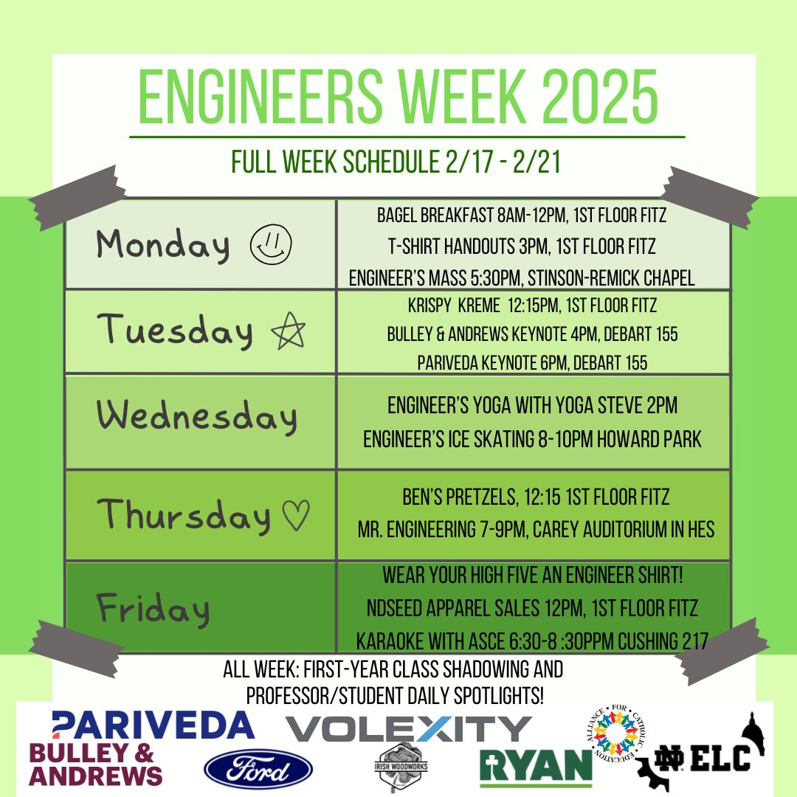
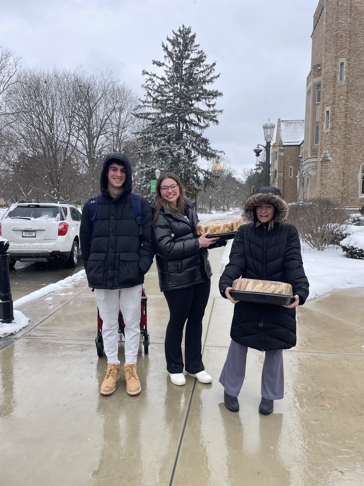
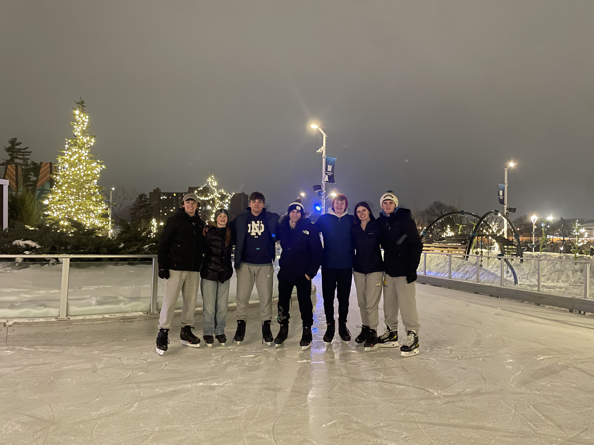
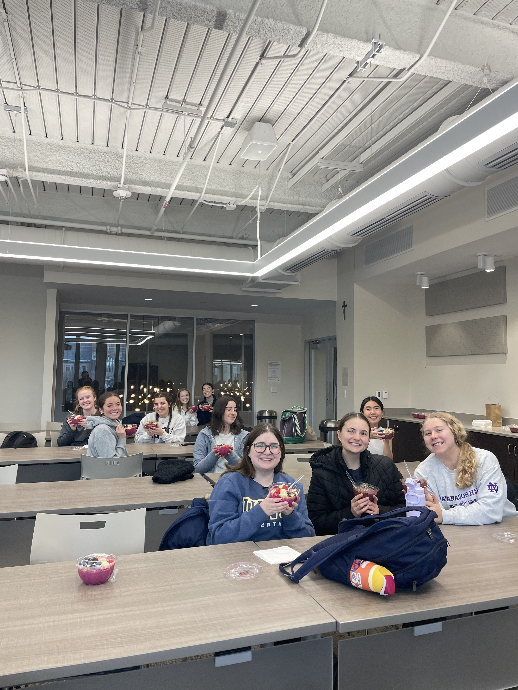
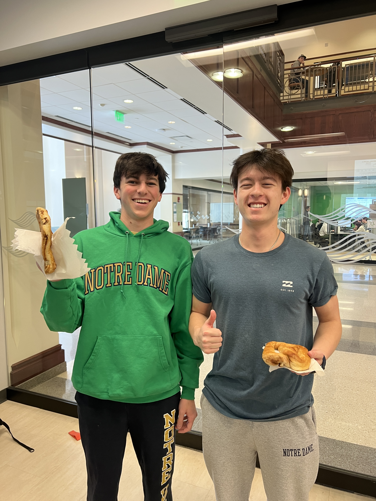

<h2> 2025 Engineers' Week Schedule </h2>

 If your company is interested in sponsoring the Engineering Leadership Council in the future , please reach out to elc@nd.edu. 

<h2> Image Gallery from 2025 </h2>

 

 

 

