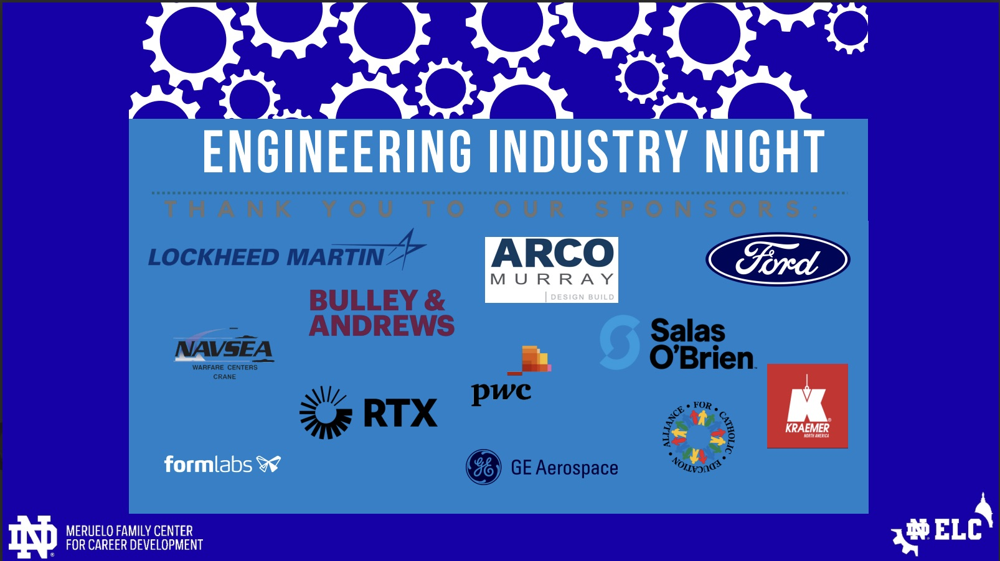

<h1>2025-2026 Sponsors</h1>

 We are proud to announce the following sponsors 

<!--

-->

<h2>Sponsorship and Events</h2>

Each spring, the Engineering Leadership Council puts companies in front of Notre Dame's engineering students at the times they're paying the most attention. Sponsors can connect with students ahead of the Spring Career Fair on January 25–26, 2027, and then stay visible during Engineers Week, February 21–27, which has included giveaways, a bagel breakfast, and an ice skating night. If your team is hiring interns or new grads, we'd like to help you get noticed before and after the fair. If your company is interested in sponsoring, please reach out to elc@nd.edu or contact the Director of Sponsorship, John Augustyn, at jaugusty@nd.edu for more information on sponsorship benefits.

